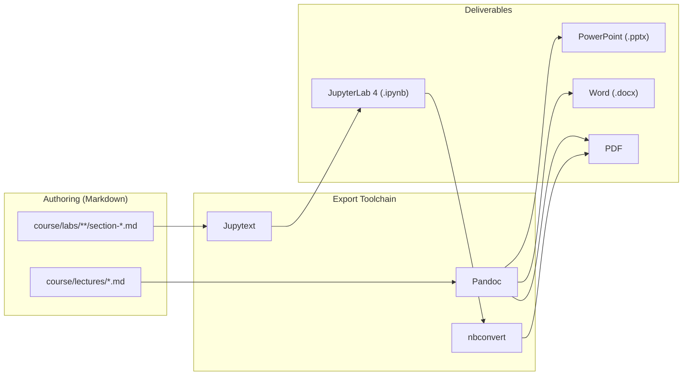
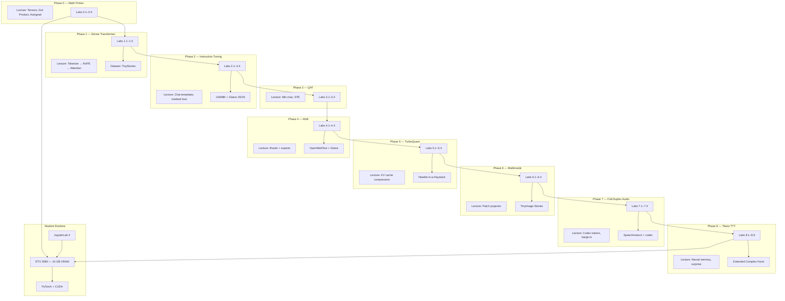
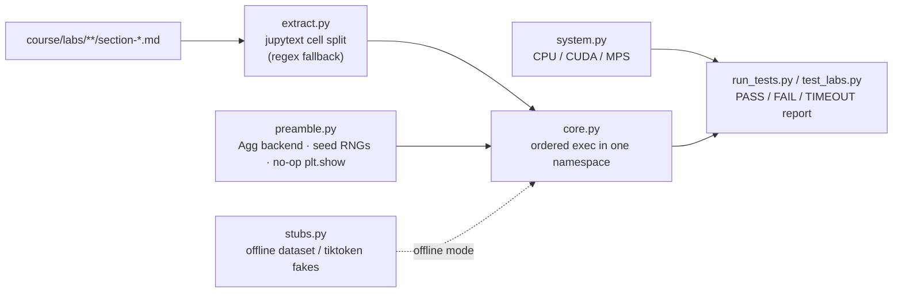
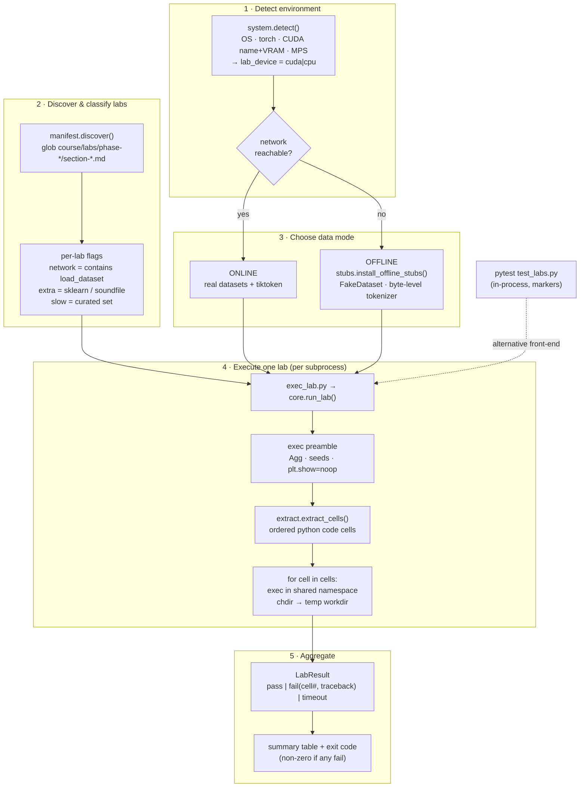

# LLMs From Scratch — Master Curriculum

PhD-level course: demystify modern LLMs by building an ~80M-parameter stack on an RTX 3080 (10 GB VRAM), from $y = mx + b$ through Google's Titans architecture.

**Source of truth:** Markdown in `course/lectures/` and `course/labs/`. Export to Word, PDF, PowerPoint, and JupyterLab 4 notebooks via the toolchain below.

---

## Architecture

### High-level course pipeline



### Detailed component map



### Repository layout

```
llms-from-scratch/
├── README.md                          ← This file (syllabus + instructor guide)
├── requirements.txt
├── requirements-test.txt              ← Extra deps for the lab test harness
├── pytest.ini
├── jupytext.toml
├── scripts/export-all.sh
├── .vscode/extensions.json
├── tests/                             ← Lab test harness (see "Testing the labs")
│   ├── run_tests.py                   ← Standalone runner (detects machine, runs all labs)
│   ├── test_labs.py                   ← Pytest entry (one test per lab)
│   ├── conftest.py / pytest config
│   ├── system.py                      ← CPU / CUDA / MPS detection
│   ├── extract.py                     ← Markdown → ordered code cells
│   ├── core.py / exec_lab.py          ← Isolated, ordered cell execution
│   ├── stubs.py                       ← Offline dataset / tokenizer fakes
│   ├── preamble.py                    ← Headless plots + RNG seeding
│   └── manifest.py                    ← Lab discovery + slow/network flags
└── course/
    ├── lectures/                      ← Slide markdown (Pandoc → PPTX/PDF/DOCX)
    │   ├── phase-00-bridging-the-gap.md
    │   ├── phase-01-dense-core.md
    │   └── … phase-08-titans.md
    └── labs/                          ← Jupytext light markdown (→ .ipynb)
        ├── phase-00-bridging-the-gap/
        │   ├── section-0-1-tensors.md
        │   └── …
        └── phase-08-titans/
            └── section-8-6-vram-profiling.md
```

---

## Syllabus

| Phase | Title | Objective | Dataset |
|-------|-------|-----------|---------|
| 0 | Bridging the Gap | Python + algebra → tensors, autograd | Synthetic arrays |
| 1 | The Dense Core | 80M Transformer from scratch | TinyStories |
| 2 | Instruction Tuning | Chat format, tool JSON | GSM8K + Glaive |
| 3 | QAT | Quantization-aware training | TinyStories + Glaive mix |
| 4 | Mixture of Experts | Router + 4 experts, same VRAM | OpenWebText + Glaive |
| 5 | TurboQuant | 3.5-bit KV cache | Needle-in-a-Haystack |
| 6 | Encoder-Free Multimodal | Gemma 4-style patches | TinyImage-Stories |
| 7 | Full-Duplex Audio | Streaming + interruptions | SpeechInstruct + codec |
| 8 | Titans | Test-time training memory | Extended Complex Facts |

**Hardware target:** NVIDIA RTX 3080, 10 GB VRAM, ~80M parameters for the core text model.

---

## How to use this course (read this first)

This course is **self-contained**. If you can write a basic Python `for` loop and you remember the line equation $y = mx + b$ from algebra, you have everything you need to start. Every new idea is introduced from scratch, in order, and each phase only relies on what earlier phases already taught.

**The golden rule:** do the phases in order. Each phase ends with a *Bridge to the Next Phase* slide, and each lab ends with a *Where This Leads Next* note, so you always know how today's idea feeds into tomorrow's.

**What each phase gives you:**

- A **lecture** (`course/lectures/phase-XX-*.md`) — the concepts, analogies, and math, exported to slides.
- A set of **labs** (`course/labs/phase-XX-*/section-*.md`) — hands-on notebooks where you write and run the code.

**How to study a single phase:**

1. Read (or attend) the lecture first — it builds the mental model.
2. Open the labs in order and run every cell. Change numbers and break things on purpose; intuition comes from experimenting.
3. Each lab opens with **What You Need to Know First** (a quick recap of prerequisites, all taught earlier) and closes with **Key Takeaway** + **Where This Leads Next**.
4. The **Further Reading (Optional)** section at the end of every lecture and lab lists the original research papers. **These are strictly optional enrichment — you never need to read them to continue.**

**If you get stuck:** re-read the "What You Need to Know First" box for that section; it names the exact earlier section where the concept was introduced.

---

## Prerequisites

**Required (that's all):**

- Basic Python: variables, lists, loops, functions, and `import`.
- High-school algebra: the line equation $y = mx + b$, and what "multiply and add" means.

**Explicitly NOT required** (we teach these as we go):

- Calculus — PyTorch's autograd computes all derivatives for you (Phase 0 explains the idea).
- Linear algebra beyond multiply-and-add — dot products and matrices are introduced in Phase 0.
- Any prior machine learning, deep learning, or PyTorch experience.

**Software:** Python 3.11+, and the packages in `requirements.txt`. A CUDA GPU (RTX 3080 target) is ideal, but every lab also runs on CPU (just slower).

---

## Instructor setup

### 1. System prerequisites

| Tool | Purpose | Install |
|------|---------|---------|
| Python 3.11+ | Labs & export scripts | `pyenv` or system Python |
| Pandoc 3.x | Lectures → PPTX, PDF, DOCX | [pandoc.org/installing](https://pandoc.org/installing.html) |
| LaTeX (optional) | Higher-quality PDF | MacTeX / TeX Live |
| CUDA 12.x + cuDNN | Student GPU training | NVIDIA driver + toolkit |

### 2. Python environment

```bash
cd llms-from-scratch
python -m venv .venv
source .venv/bin/activate   # Windows: .venv\Scripts\activate
pip install -r requirements.txt
chmod +x scripts/export-all.sh
```

**Verify the labs run** before teaching (see [Testing the labs](#testing-the-labs)):

```bash
pip install -r requirements-test.txt
python tests/run_tests.py --quick   # fast smoke test; drop --quick for the full run
```

### 3. VS Code / Cursor extensions

Install the recommended set (Cursor/VS Code will prompt via `.vscode/extensions.json`):

| Extension | ID | Role |
|-----------|-----|------|
| Python | `ms-python.python` | Interpreter, linting |
| Jupyter | `ms-toolsai.jupyter` | Open `.ipynb`, run cells |
| Markdown All in One | `yzhang.markdown-all-in-one` | TOC, preview |
| Marp for VS Code | `marp-team.marp-vscode` | Optional slide preview |
| Pandoc Citer | `chrischinchilla.vscode-pandoc` | Single-file Pandoc export from editor |

**Command Palette → “Extensions: Show Recommended Extensions” → Install All.**

### 4. JupyterLab 4 extensions (student & instructor)

```bash
pip install jupyterlab>=4.0 jupytext
jupyter labextension list
```

Recommended JupyterLab 4 extensions:

```bash
pip install jupyterlab-git
jupyter labextension enable jupyterlab-jupytext   # if packaged separately
```

Configure Jupytext pairing globally (once per machine):

```bash
jupyter labextension enable jupytext
# Or in JupyterLab: Settings → Advanced Settings Editor → Jupytext → add "light" for .md
```

The repo root `jupytext.toml` sets default kernel metadata for all paired notebooks.

---

## Export workflows

Generated files go to `exports/` (gitignored). **Always edit markdown source**, then re-export.

### Lectures → PowerPoint (primary)

Lectures use Pandoc slide breaks (`---` on its own line). Level-2 headings (`##`) start new slides.

**Single lecture:**

```bash
pandoc course/lectures/phase-01-dense-core.md \
  -o exports/lectures/pptx/phase-01-dense-core.pptx \
  --slide-level=2 \
  -t pptx
```

**All lectures:**

```bash
./scripts/export-all.sh
```

**Tips for better PPTX:**

- Keep one main idea per slide; use `##` not `#` for slide titles after the title slide.
- Put `$...$` math inline; Pandoc converts to Office Math.
- Optional branded template: add `--reference-doc=instructor/templates/reference.pptx` once you create a master deck.

**Lectures → Word / PDF:**

```bash
pandoc course/lectures/phase-01-dense-core.md -o exports/lectures/docx/phase-01-dense-core.docx

pandoc course/lectures/phase-01-dense-core.md \
  -o exports/lectures/pdf/phase-01-dense-core.pdf \
  --slide-level=2 -t beamer
```

### Labs → JupyterLab 4 `.ipynb` (primary)

Labs use [Jupytext "light" format](https://jupytext.readthedocs.io/en/latest/formats.html#light-format): YAML front matter + fenced `python` blocks become code cells; other markdown becomes markdown cells.

**Single lab:**

```bash
jupytext --to ipynb \
  course/labs/phase-00-bridging-the-gap/section-0-1-tensors.md \
  -o exports/labs/ipynb/phase-00-bridging-the-gap/section-0-1-tensors.ipynb
```

**Open paired notebook in JupyterLab 4:**

```bash
jupyter lab course/labs/
# Jupytext auto-pairs .md ↔ .ipynb when configured; or export first and open exports/labs/ipynb/
```

**Round-trip (student edits ipynb → sync back to markdown):**

```bash
jupytext --sync exports/labs/ipynb/phase-00-bridging-the-gap/section-0-1-tensors.ipynb
```

**Lab → PDF (after export to ipynb):**

```bash
jupyter nbconvert --to pdf exports/labs/ipynb/phase-00-bridging-the-gap/section-0-1-tensors.ipynb
```

### Batch export everything

```bash
./scripts/export-all.sh
```

Outputs:

- `exports/lectures/pptx/*.pptx`
- `exports/lectures/docx/*.docx`
- `exports/lectures/pdf/*.pdf`
- `exports/labs/ipynb/**/*.ipynb`

---

## Testing the labs

Every lab is a runnable notebook, so "is the course still correct?" is answered by
**actually executing the real code in each `.md` file**. The harness in `tests/`
does exactly that — it extracts the Python cells from the markdown (the same cell
split Jupytext uses to build the `.ipynb`), runs them in order in an isolated
namespace, and reports any failure with the offending cell and traceback.

It is designed to run unchanged on both target machines and to auto-detect which
one it is on:

| Machine | Accelerator detected | Device labs run on |
|---------|----------------------|--------------------|
| MacBook Air M5 (24 GB) | Apple MPS (reported) | CPU* |
| Windows i7 + RTX 3080 (10 GB) | CUDA | CUDA (GPU) |

\* The lab code selects its device with `device = "cuda" if torch.cuda.is_available() else "cpu"`,
so on Apple Silicon it runs on CPU by design. The harness still detects and reports MPS.

### Quick start

```bash
# from the repo root, in your course virtualenv
pip install -r requirements.txt -r requirements-test.txt

# Option A — standalone runner (recommended): detects the machine, runs every lab
python tests/run_tests.py

# Option B — pytest: one test per lab, rich tracebacks
pytest tests/
```

Both auto-detect the system and print it before running. The standalone runner
also auto-picks **online** mode (real dataset downloads) when the network is
reachable and **offline** mode (synthetic data) when it is not.

### Common commands

```bash
python tests/run_tests.py --quick         # skip the slow training labs (fast smoke test)
python tests/run_tests.py --offline        # force synthetic data (air-gapped / no downloads)
python tests/run_tests.py --online         # force real Hugging Face downloads
python tests/run_tests.py --phase 1        # only Phase 1 labs
python tests/run_tests.py --only attention # substring filter on the lab path
python tests/run_tests.py --jobs 4         # run 4 labs in parallel (use --jobs 1 on a single GPU)

pytest tests/ -m "not slow"               # skip heavy training labs
pytest tests/ -m "not network"            # skip dataset-loading labs
pytest tests/ --online                     # use real downloads
pytest tests/ -k tokenization             # single lab by name
```

> On a single-GPU box (RTX 3080) keep `--jobs 1` so labs don't contend for the
> 10 GB of VRAM. Parallel jobs are useful on the M5 (CPU) for faster smoke runs.

### How it works



Key design decisions:

- **Real code, real order.** A lab is treated as one notebook: later cells depend
  on earlier ones, so all cells share a single namespace and run top-to-bottom.
  Tests fail exactly where a student's kernel would.
- **System auto-detection** (`system.py`) reports OS, PyTorch, CUDA device + VRAM,
  and Apple MPS, and computes the device the labs will actually use.
- **Two data modes.** *Online* exercises the real `load_dataset` downloads that
  students hit. *Offline* installs synthetic stand-ins (`stubs.py`) that mirror the
  Hugging Face `Dataset` indexing contract exactly — so air-gapped runs still catch
  API-misuse bugs instead of hiding them.
- **Isolation + timeouts.** `run_tests.py` runs each lab in its own subprocess, so
  state never leaks between labs and a hung lab is killed by a per-lab timeout
  (longer for labs tagged `slow`). Working directories are throwaway temp folders,
  so checkpoints / PNGs / WAVs never touch the repo.
- **Headless + reproducible** (`preamble.py`): forces the matplotlib `Agg` backend,
  neutralises `plt.show()`, and seeds Python/NumPy/Torch before each lab.
- **Markers** (`network`, `slow`, `extra_deps`) are derived per lab in `manifest.py`
  so you can include/exclude categories.

### Detailed harness architecture



### Interpreting results

- `PASS` — every cell in the lab executed without raising.
- `FAIL` — a cell raised; the report shows the cell index, exception type/message,
  and (in pytest) the cell source plus traceback.
- `TIME` — the lab exceeded its timeout (raise `--timeout`, or it may indicate a hang).

For full-fidelity validation before teaching, run on the RTX 3080 box in online mode:
`python tests/run_tests.py --online --jobs 1`. Use `--quick` on the laptop for a fast
sanity check that skips the heavy training labs (which are slow on CPU but fast on GPU).

---

## Authoring conventions

### Lectures (`course/lectures/`)

- YAML metadata block: `title`, `subtitle`, `author`.
- `---` horizontal rule = new slide.
- `## Slide Title` for content slides.
- Speaker notes: HTML comment `<!-- notes: ... -->` (visible in Marp; ignored by Pandoc PPTX unless using `--reference-doc` with notes master).

### Labs (`course/labs/phase-XX-*/section-*.md`)

- Jupytext front matter with `jupytext` + `kernelspec` keys (see any lab file).
- One concept per section; executable Python in fenced blocks.
- Use `# %%` only if you switch to percent format; this course standardizes on **light** format.
- Keep VRAM-safe defaults: `batch_size=8`, `block_size=256` until Phase 5+.

---

## Teaching notes

1. **Phase 0** is mandatory for students weak on linear algebra; skip only if they already use PyTorch daily.
2. **Phase 1** checkpoint is the backbone reused in Phases 2–8; save `checkpoints/phase1_80m.pt`.
3. **VRAM budget:** log `torch.cuda.max_memory_allocated()` at the end of every lab (Phase 8.6 formalizes this).
4. Datasets are downloaded inside labs via `datasets` / custom loaders; large files stay out of git.

---

## Glossary (plain-language)

Quick definitions for terms used throughout the course. Each is explained in full where it first appears.

| Term | Plain meaning |
|------|---------------|
| **Tensor** | A multi-dimensional array of numbers (a number, list, table, or cube of numbers). |
| **Weight / bias** | The $m$ and $b$ in $y = mx + b$ — the numbers the model learns. |
| **Parameter** | Any learnable number in the model (weights and biases). |
| **Dot product** | Multiply matching entries of two lists and add them up; measures similarity. |
| **Embedding** | A learned vector (list of numbers) that represents a token as a point in space. |
| **Token** | A chunk of text (word or sub-word) turned into an integer ID. |
| **Logits** | The raw, pre-probability scores a model outputs before softmax. |
| **Softmax** | Turns a list of scores into probabilities that sum to 1. |
| **Loss** | A single number measuring how wrong the model is; training shrinks it. |
| **Gradient** | The direction/size of a nudge to each weight that reduces the loss. |
| **Autograd** | PyTorch's automatic gradient calculator — no hand calculus needed. |
| **Attention** | A mechanism that lets each token look at others via dot products. |
| **RoPE** | Rotary Position Embedding — encodes word order by rotating vectors. |
| **Quantization** | Storing numbers with fewer bits (e.g., 4-bit ints) to save memory. |
| **STE** | Straight-Through Estimator — lets gradients flow through rounding. |
| **MoE** | Mixture of Experts — route each token to one of several sub-networks. |
| **KV cache** | Stored Keys/Values of past tokens so the model needn't recompute them. |
| **Codec** | A model that turns audio waveforms into discrete integer tokens. |
| **TTT** | Test-Time Training — updating a small memory network during inference. |
| **VRAM** | The GPU's memory; our hard limit is 10 GB (RTX 3080). |

---

## Master bibliography (all optional)

Every paper referenced in the course, gathered here for convenience. **None of these are required reading** — the course is fully self-contained. They are listed for students who want to go deeper into a topic.

**Foundations (Phase 0)**

- Rumelhart, Hinton, & Williams (1986). *Learning representations by back-propagating errors*. Nature.
- Cybenko (1989). *Approximation by Superpositions of a Sigmoidal Function*.
- Goodfellow, Bengio, & Courville (2016). *Deep Learning*. MIT Press (free at deeplearningbook.org).
- Paszke et al. (2019). *PyTorch: An Imperative Style, High-Performance Deep Learning Library*. NeurIPS.
- Kingma & Ba (2015). *Adam: A Method for Stochastic Optimization*. ICLR.

**Transformers & language modeling (Phase 1)**

- Vaswani et al. (2017). *Attention Is All You Need*. NeurIPS.
- Sennrich, Haddow, & Birch (2016). *Neural Machine Translation of Rare Words with Subword Units (BPE)*. ACL.
- Su et al. (2021). *RoFormer: Enhanced Transformer with Rotary Position Embedding*. arXiv:2104.09864.
- Ba, Kiros, & Hinton (2016). *Layer Normalization*. arXiv:1607.06450.
- Radford et al. (2019). *Language Models are Unsupervised Multitask Learners (GPT-2)*. OpenAI.
- Eldan & Li (2023). *TinyStories*. arXiv:2305.07759.
- Dao et al. (2022). *FlashAttention*. NeurIPS.

**Instruction tuning & tools (Phase 2)**

- Ouyang et al. (2022). *Training language models to follow instructions with human feedback (InstructGPT)*. NeurIPS.
- Wei et al. (2022). *Chain-of-Thought Prompting Elicits Reasoning in LLMs*. NeurIPS.
- Cobbe et al. (2021). *Training Verifiers to Solve Math Word Problems (GSM8K)*. arXiv:2110.14168.
- Schick et al. (2023). *Toolformer*. NeurIPS.
- DeepSeek-AI (2025). *DeepSeek-R1*. arXiv:2501.12948.

**Quantization (Phases 3 & 5)**

- Bengio, Léonard, & Courville (2013). *Estimating or Propagating Gradients Through Stochastic Neurons (STE)*. arXiv:1308.3432.
- Jacob et al. (2018). *Quantization and Training of Neural Networks for Efficient Integer-Arithmetic-Only Inference*. CVPR.
- Dettmers et al. (2022). *LLM.int8()*. NeurIPS.
- Frantar et al. (2022). *GPTQ*. arXiv:2210.17323.
- Chee et al. (2023). *QuIP*. NeurIPS.
- Tseng et al. (2024). *QuIP#*. ICML.
- Ashkboos et al. (2024). *QuaRot*. arXiv:2404.00456.
- Liu et al. (2024). *KIVI*. ICML.

**Mixture of Experts (Phase 4)**

- Shazeer et al. (2017). *Outrageously Large Neural Networks: The Sparsely-Gated MoE Layer*. ICLR.
- Lepikhin et al. (2020). *GShard*. arXiv:2006.16668.
- Fedus, Zoph, & Shazeer (2021). *Switch Transformers*. JMLR.
- Jiang et al. (2024). *Mixtral of Experts*. arXiv:2401.04088.

**Multimodal (Phase 6)**

- Dosovitskiy et al. (2020). *An Image is Worth 16x16 Words (ViT)*. ICLR.
- Radford et al. (2021). *CLIP*. ICML.
- Alayrac et al. (2022). *Flamingo*. NeurIPS.
- Bavishi et al. (2023). *Fuyu-8B*. Adept AI.
- Liu et al. (2023). *Visual Instruction Tuning (LLaVA)*. NeurIPS.

**Audio (Phase 7)**

- van den Oord, Vinyals, & Kavukcuoglu (2017). *Neural Discrete Representation Learning (VQ-VAE)*. NeurIPS.
- Zeghidour et al. (2021). *SoundStream*. IEEE/ACM TASLP.
- Défossez et al. (2022). *High Fidelity Neural Audio Compression (EnCodec)*. arXiv:2210.13438.
- Wang et al. (2023). *VALL-E*. arXiv:2301.02111.
- Défossez et al. (2024). *Moshi*. arXiv:2410.00037.

**Memory & test-time training (Phase 8)**

- Graves, Wayne, & Danihelka (2014). *Neural Turing Machines*. arXiv:1410.5401.
- Finn, Abbeel, & Levine (2017). *Model-Agnostic Meta-Learning (MAML)*. ICML.
- Katharopoulos et al. (2020). *Transformers are RNNs (Linear Attention)*. ICML.
- Gu & Dao (2023). *Mamba*. arXiv:2312.00752.
- Sun et al. (2024). *Learning to (Learn at Test Time)*. arXiv:2407.04620.
- Behrouz, Zhong, & Mirrokni (2024). *Titans: Learning to Memorize at Test Time*. arXiv:2501.00663.

> Naming note: *TurboQuant* and *PolarQuant* are teaching names used in this course for the rotation-then-quantize family of methods pioneered by QuIP#/QuaRot.

---

## License

MIT — adapt freely for classroom use.
