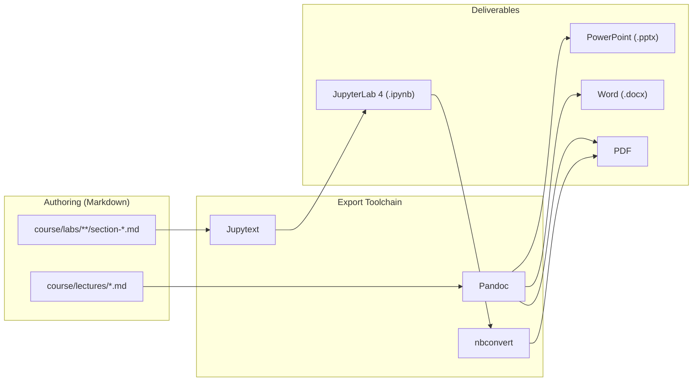
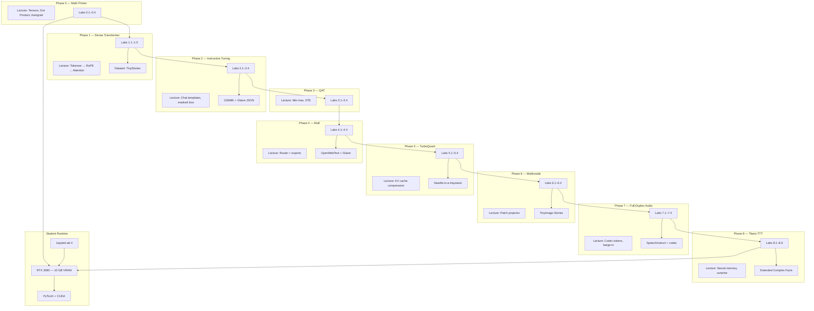

# LLMs From Scratch — Master Curriculum

PhD-level course: demystify modern LLMs by building an ~80M-parameter stack on an RTX 3080 (10 GB VRAM), from $y = mx + b$ through Google's Titans architecture.

**Source of truth:** Markdown in `course/lectures/` and `course/labs/`. Export to Word, PDF, PowerPoint, and JupyterLab 4 notebooks via the toolchain below.

---

## Architecture

### High-level course pipeline



### Detailed component map



### Repository layout

```
llms-from-scratch/
├── README.md                          ← This file (syllabus + instructor guide)
├── requirements.txt
├── jupytext.toml
├── scripts/export-all.sh
├── .vscode/extensions.json
└── course/
    ├── lectures/                      ← Slide markdown (Pandoc → PPTX/PDF/DOCX)
    │   ├── phase-00-bridging-the-gap.md
    │   ├── phase-01-dense-core.md
    │   └── … phase-08-titans.md
    └── labs/                          ← Jupytext light markdown (→ .ipynb)
        ├── phase-00-bridging-the-gap/
        │   ├── section-0-1-tensors.md
        │   └── …
        └── phase-08-titans/
            └── section-8-6-vram-profiling.md
```

---

## Syllabus

| Phase | Title | Objective | Dataset |
|-------|-------|-----------|---------|
| 0 | Bridging the Gap | Python + algebra → tensors, autograd | Synthetic arrays |
| 1 | The Dense Core | 80M Transformer from scratch | TinyStories |
| 2 | Instruction Tuning | Chat format, tool JSON | GSM8K + Glaive |
| 3 | QAT | Quantization-aware training | TinyStories + Glaive mix |
| 4 | Mixture of Experts | Router + 4 experts, same VRAM | OpenWebText + Glaive |
| 5 | TurboQuant | 3.5-bit KV cache | Needle-in-a-Haystack |
| 6 | Encoder-Free Multimodal | Gemma 4-style patches | TinyImage-Stories |
| 7 | Full-Duplex Audio | Streaming + interruptions | SpeechInstruct + codec |
| 8 | Titans | Test-time training memory | Extended Complex Facts |

**Hardware target:** NVIDIA RTX 3080, 10 GB VRAM, ~80M parameters for the core text model.

---

## Instructor setup

### 1. System prerequisites

| Tool | Purpose | Install |
|------|---------|---------|
| Python 3.11+ | Labs & export scripts | `pyenv` or system Python |
| Pandoc 3.x | Lectures → PPTX, PDF, DOCX | [pandoc.org/installing](https://pandoc.org/installing.html) |
| LaTeX (optional) | Higher-quality PDF | MacTeX / TeX Live |
| CUDA 12.x + cuDNN | Student GPU training | NVIDIA driver + toolkit |

### 2. Python environment

```bash
cd llms-from-scratch
python -m venv .venv
source .venv/bin/activate   # Windows: .venv\Scripts\activate
pip install -r requirements.txt
chmod +x scripts/export-all.sh
```

### 3. VS Code / Cursor extensions

Install the recommended set (Cursor/VS Code will prompt via `.vscode/extensions.json`):

| Extension | ID | Role |
|-----------|-----|------|
| Python | `ms-python.python` | Interpreter, linting |
| Jupyter | `ms-toolsai.jupyter` | Open `.ipynb`, run cells |
| Markdown All in One | `yzhang.markdown-all-in-one` | TOC, preview |
| Marp for VS Code | `marp-team.marp-vscode` | Optional slide preview |
| Pandoc Citer | `chrischinchilla.vscode-pandoc` | Single-file Pandoc export from editor |

**Command Palette → “Extensions: Show Recommended Extensions” → Install All.**

### 4. JupyterLab 4 extensions (student & instructor)

```bash
pip install jupyterlab>=4.0 jupytext
jupyter labextension list
```

Recommended JupyterLab 4 extensions:

```bash
pip install jupyterlab-git
jupyter labextension enable jupyterlab-jupytext   # if packaged separately
```

Configure Jupytext pairing globally (once per machine):

```bash
jupyter labextension enable jupytext
# Or in JupyterLab: Settings → Advanced Settings Editor → Jupytext → add "light" for .md
```

The repo root `jupytext.toml` sets default kernel metadata for all paired notebooks.

---

## Export workflows

Generated files go to `exports/` (gitignored). **Always edit markdown source**, then re-export.

### Lectures → PowerPoint (primary)

Lectures use Pandoc slide breaks (`---` on its own line). Level-2 headings (`##`) start new slides.

**Single lecture:**

```bash
pandoc course/lectures/phase-01-dense-core.md \
  -o exports/lectures/pptx/phase-01-dense-core.pptx \
  --slide-level=2 \
  -t pptx
```

**All lectures:**

```bash
./scripts/export-all.sh
```

**Tips for better PPTX:**

- Keep one main idea per slide; use `##` not `#` for slide titles after the title slide.
- Put `$...$` math inline; Pandoc converts to Office Math.
- Optional branded template: add `--reference-doc=instructor/templates/reference.pptx` once you create a master deck.

**Lectures → Word / PDF:**

```bash
pandoc course/lectures/phase-01-dense-core.md -o exports/lectures/docx/phase-01-dense-core.docx

pandoc course/lectures/phase-01-dense-core.md \
  -o exports/lectures/pdf/phase-01-dense-core.pdf \
  --slide-level=2 -t beamer
```

### Labs → JupyterLab 4 `.ipynb` (primary)

Labs use [Jupytext "light" format](https://jupytext.readthedocs.io/en/latest/formats.html#light-format): YAML front matter + fenced `python` blocks become code cells; other markdown becomes markdown cells.

**Single lab:**

```bash
jupytext --to ipynb \
  course/labs/phase-00-bridging-the-gap/section-0-1-tensors.md \
  -o exports/labs/ipynb/phase-00-bridging-the-gap/section-0-1-tensors.ipynb
```

**Open paired notebook in JupyterLab 4:**

```bash
jupyter lab course/labs/
# Jupytext auto-pairs .md ↔ .ipynb when configured; or export first and open exports/labs/ipynb/
```

**Round-trip (student edits ipynb → sync back to markdown):**

```bash
jupytext --sync exports/labs/ipynb/phase-00-bridging-the-gap/section-0-1-tensors.ipynb
```

**Lab → PDF (after export to ipynb):**

```bash
jupyter nbconvert --to pdf exports/labs/ipynb/phase-00-bridging-the-gap/section-0-1-tensors.ipynb
```

### Batch export everything

```bash
./scripts/export-all.sh
```

Outputs:

- `exports/lectures/pptx/*.pptx`
- `exports/lectures/docx/*.docx`
- `exports/lectures/pdf/*.pdf`
- `exports/labs/ipynb/**/*.ipynb`

---

## Authoring conventions

### Lectures (`course/lectures/`)

- YAML metadata block: `title`, `subtitle`, `author`.
- `---` horizontal rule = new slide.
- `## Slide Title` for content slides.
- Speaker notes: HTML comment `<!-- notes: ... -->` (visible in Marp; ignored by Pandoc PPTX unless using `--reference-doc` with notes master).

### Labs (`course/labs/phase-XX-*/section-*.md`)

- Jupytext front matter with `jupytext` + `kernelspec` keys (see any lab file).
- One concept per section; executable Python in fenced blocks.
- Use `# %%` only if you switch to percent format; this course standardizes on **light** format.
- Keep VRAM-safe defaults: `batch_size=8`, `block_size=256` until Phase 5+.

---

## Teaching notes

1. **Phase 0** is mandatory for students weak on linear algebra; skip only if they already use PyTorch daily.
2. **Phase 1** checkpoint is the backbone reused in Phases 2–8; save `checkpoints/phase1_80m.pt`.
3. **VRAM budget:** log `torch.cuda.max_memory_allocated()` at the end of every lab (Phase 8.6 formalizes this).
4. Datasets are downloaded inside labs via `datasets` / custom loaders; large files stay out of git.

---

## License

MIT — adapt freely for classroom use.
